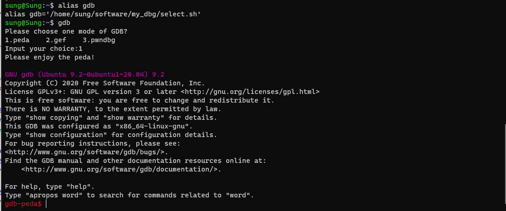

# WSL 1 下的 GDB 插件切换

## 用法

在使用脚本前请确认：

* 已经安装peda、pwndbg、gef，并已经知道安装路径
* 在`~/.gdbinit`添加`# this place is controled by user's shell`（注释下一行将被覆盖）

用法：

* 在`select.sh`中进行路径替换
* 执行`setup.sh`
* 测试`gdb`命令

## 思路

`select.sh`文件

在`~/.gdbinit`替换`# this place is controled by user's shell`下一行的内容为`source`，最后启动`/usr/bin/gdb`

````shell
#!/bin/bash

echo -e "Please choose one mode of GDB?\n1.peda    2.gef    3.pwndbg"
read -r -p "Input your choice:" num
case "${num}" in
1)
    name='1'
    ;;
2)
    name='2'
    ;;
3)
    name='3'
    ;;
*)
    echo -e "Error!!!!\nPleasse input right number!"
    ;;
esac
gdbinitfile=~/.gdbinit

peda="source ~/software/my_dbg/peda/peda.py"
gef="source /home/sung/software/my_dbg/gef/.gdbinit-gef.py"
pwndbg="source /home/sung/software/my_dbg/pwndbg/gdbinit.py"

sign=$(cat $gdbinitfile | grep -n "# this place is controled by user's shell")
number=${sign:0:1}
location=$((number + 1))

if [ $name -eq "1" ]; then
    sed -i "${location}c $peda" $gdbinitfile
    echo -e "Please enjoy the peda!\n"
elif [ $name -eq "2" ]; then
    sed -i "${location}c $gef" $gdbinitfile
    echo -e "Please enjoy the gef!\n"
else
    sed -i "${location}c $pwndbg" $gdbinitfile
    echo -e "Please enjoy the pwndbg!\n"
fi
/usr/bin/gdb

````

然后通过`alias`工具设置`alias gdb=~/software/my_dbg/select.sh`



`setup.sh`文件，实现永久化，需要在`~/.bashrc`里追加这个内容

````shell
#!/bin/bash
echo alias gdb='~/software/my_dbg/select.sh' >> ~/.bashrc
source ~/.bashrc
````

